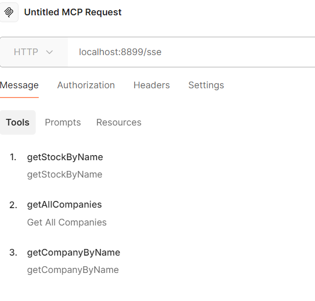
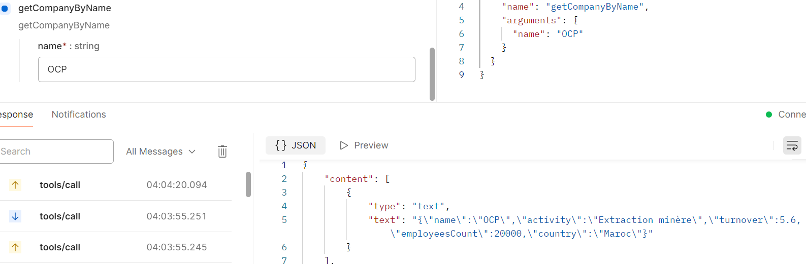
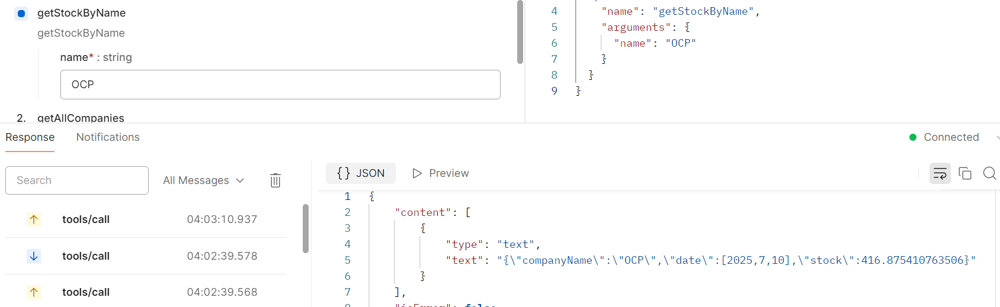
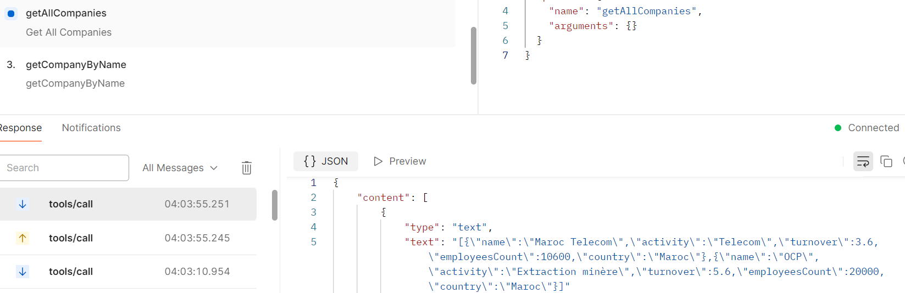
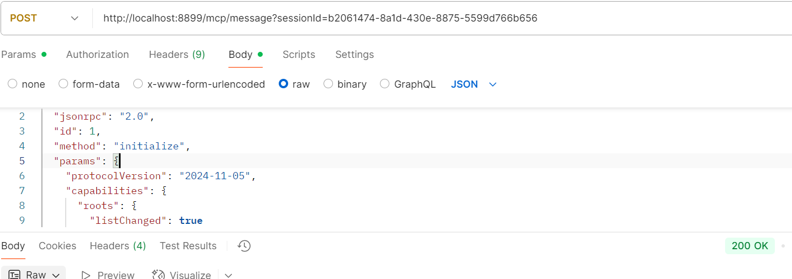
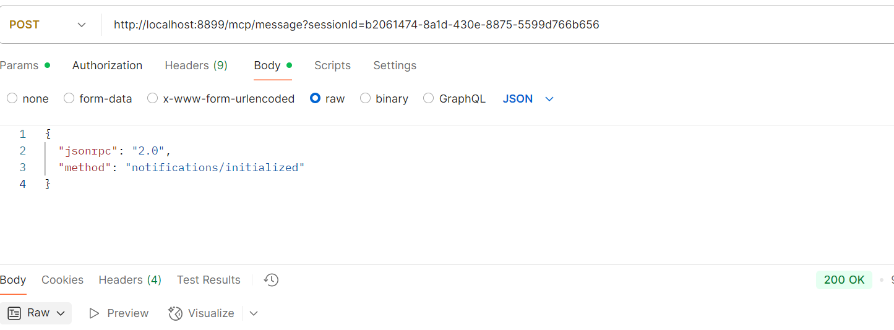
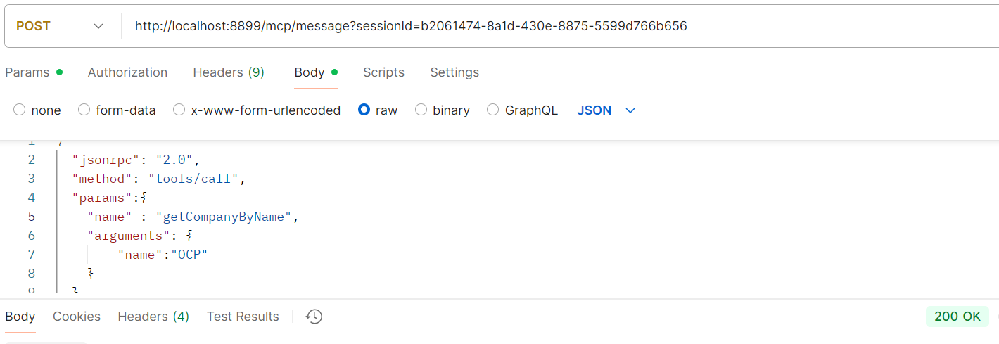
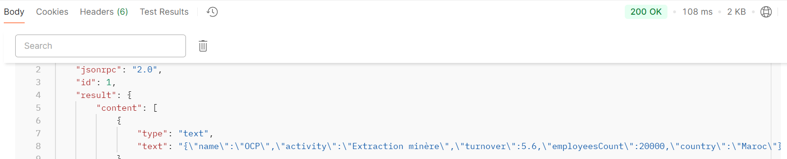
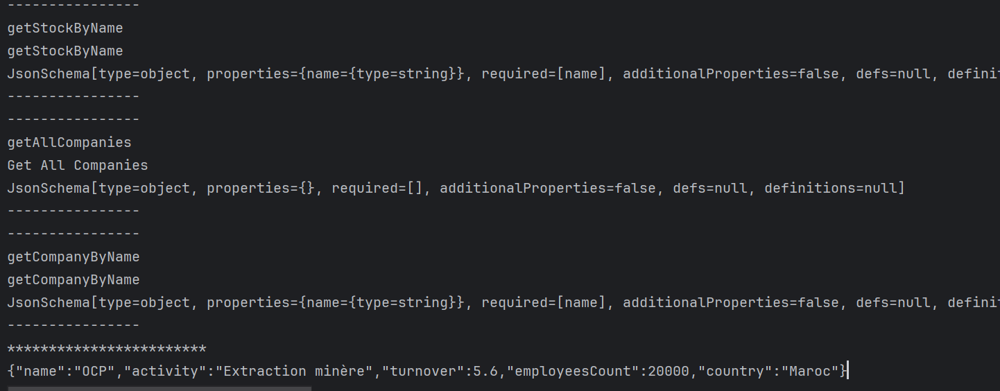

# AI MCP Chatbot Platform

## Description

Ce projet a pour objectif de développer une plateforme chatbot innovante basée sur le protocole **MCP **.  
Il combine plusieurs technologies modernes : Spring AI, MCP, Python et NodeJS, pour créer un système distribué multi-langages capable de gérer des conversations intelligentes.

Le projet met en œuvre un serveur MCP avec Java Spring, un client MCP intégrant des modèles d'IA comme Llama 3.2, Claude et OpenAI, ainsi que des serveurs MCP complémentaires en Python et NodeJS.

## Fonctionnalités principales

- Implémentation du protocole MCP pour la communication entre serveurs et clients.  
- Serveur MCP SSE (Server-Sent Events) avec Spring Boot.  
- Client MCP capable d’intégrer plusieurs moteurs d’IA pour la génération de réponses.  
- Serveurs MCP supplémentaires en Python et NodeJS, déployés en mode STDIO pour une intégration fluide.  
- Tests fonctionnels via Postman et Swagger UI.  
- Application agentique : prise de décision autonome et intelligente.  
- Préparation d’une interface frontend en Angular ou React pour l’interaction utilisateur.

## Technologies utilisées

- **Java Spring Boot** (serveur MCP SSE, client Spring AI)  
- **Python** (serveur MCP, scripts)  
- **NodeJS** (serveur MCP en mode STDIO)  
- **MCP** (protocole Model-Context-Protocol)  
- **Postman & Swagger UI** (tests API)  
- **Llama 3.2, Claude, OpenAI** (moteurs d’intelligence artificielle intégrés)  
- **Frontend Angular/React** (à développer)

## Installation et exécution

1. Cloner le dépôt :  
   ```bash
   git clone https://github.com/MayssamSe/ai-mcp-chatbot-platform.git
   ```
2. Configurer les environnements Spring, Python et NodeJS selon les instructions dans chaque dossier.  
3. Lancer les serveurs MCP en suivant les guides dans les dossiers respectifs (`mcp-server`, `python-mcp-server`, `mcp-node-server`).  
4. Tester les serveurs MCP avec Postman ou via Swagger UI.  
5. Lancer le client MCP Spring AI et établir la communication avec les serveurs.  
6. (Optionnel) Développer et lancer le frontend Angular/React.

## Tests et résultats

### Tests serveur MCP avec Postman









### Tests avec requêtes HTML









### Tests client MCP



---

**Auteur:** Mayssam Sehait  


